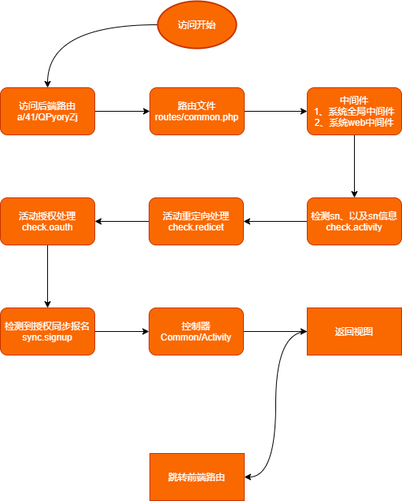
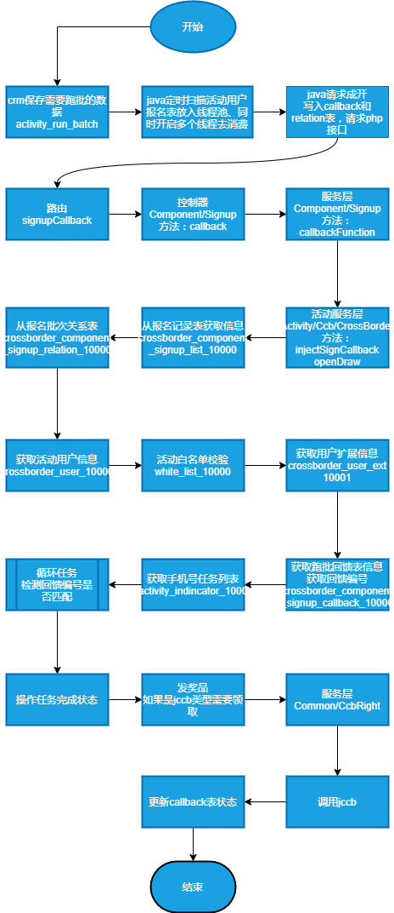

## 1、活动访问流程

> [!TIP]
> 活动路径 http://ccbhdbch.kerlala.com/a/41/QPyoryZj  经历了哪些处理




### 1.1、路由文件

```
routes/common.php

Route::get('a/{pid}/{sn}/{action?}/{param1?}/{param2?}', 'Common\ActivityController@index')->middleware(['check.activity', 'check.redirect', 'check.oauth', 'sync.signup'])->name('spa.index');
```

### 1.2 中间件层

> [!TIP]
> 在app/Http/Kernel.php

```php
1、系统全局中间件
2、web中间组
3、定义的中间件 （重点）
```

#### 1.2.1 check.activity

```php
//检测路由sn参数
$activitySn = $request->route('sn'); // 活动ID
        
if (empty($activitySn)) {
    return $next($request);
}
// 解析路由参数  activity_route表信息 、同时request全局参数注册
$params = $this->parseRoute($activitySn);

//主要Model层使用
$params = [
    'hd_activity_database' => 'activity_' . $activity->database,//映射的库的链接
    'hd_activity_table_id' => $activity->table, // 映射额分表
    'hd_activity_type' => $activity->activity_type, //活动类型
    'hd_activity_id' => $activity->id,//活动全局ID
    'master_id' => $activity->master_id,//主账号ID
    'sub_table' => ! empty($activity->sub_table) ? json_decode($activity->sub_table, true) : [],
    'is_show_page' => $this->checkShowPage($activitySn) //是否显式授权
];

if (empty($params)) {    
    abort(404);
}
return $next($request);
```
#### 1.2.2 check.redicet

```php
不贴代码了，主要看config/redirect.php 文件
```
#### 1.2.3 check.oauth

```php
1、获取平台信息  根据pid
Platform::getPlatformById($platformId); //platforms  在系统后台配置
2、request全局属性添加

3、具体的授权处理，去除多余参数生成url跳转(主要检测_ident,code,state),如果带return_url就重定向带上open_id
$wxComponetService = app(WxComponentService::class);
$oauthRes = $wxComponetService->oauth((array) $platform, request()->attributes->get('is_show_page', 1));

建行全平台授权在:App\Services\Oauth\Ccball.php;

    1、解析app传的参数和签名等等 走app授权 授权成功会同步platform_users_0 +session
    2、微信环境就走微信授权 测试环境授权成功会同步 platform_users_0 + session 生产环境授权不同步
    3、如果有客户状态直接返回 获取的session缓存
    4、返回 1041 未授权
    5、根据授权信息查询全平台记录 activity_0:ccb_many_platform_relation
    6、查询全平台用户信息platform_users_0 +同步session 


```
#### 1.2.4 sync.signup

```php
1、判断如果授权就开始逻辑
2、获取平台用户信息  platform_users_0表 实际是session缓存的值
3、判断关联了报名组件5的处理
4、ccb_all_platform_user_ext 表信息
5、判断条件生成报名信息
6、获取活动用户信息不存在就同步 app\Models\Common\ActivityUser （先获取平台用户->在同步到活动用户表 crossborder_user_10000_1） crossborder活动类型、10000=masterId 1 = table(分表)
7、首次用户表不存在的时候上传行内报名数据 App\Services\Common\JpartnerService 
```

### 1.3 控制器 Common/ActivityController.php

```php
1、获取活动产品信息，主要拿组件信息
2、判断u参数，处理分享逻辑（单个活动逻辑或者活动分享记录表 crossborder_share_visit_log_10000_1）
3、判断好友组件开启，记录好友关系 crossborder_component_friend_log_10000_1_12
4、如果在授权情况下初始化抽奖组件
5、初始化抽奖用户 crossborder_draw_user_ext_10000_1 有则返回没有就创建并且记录抽奖次数遏制  crossborder_component_draw_user_draw_num_log_10000_1
6、如果有分享信息,就加分享机会 由创建产品  draw.forward_draw_count_limit 开关是否加
7、初始化助力组件,初始化助力用户 crossborder_component_help_user_ext_10000_1 表
8、初始化任务组件
9、数据统计处理
10、展示视图，传数据，实际上走到前端路由
```
### 1.4 详细解读下任务组件初始化

> App\Services\Component\Task\TaskService  shareEvent

```
1、taskSetCacheByCode()方法获取任务配置 crossborder_component_task_set_10000_1 and crossborder_component_task_reward_10000_1
2、createTask()创建具体任务类  根据set表code检索对应的任务类并返回
3、判断任务是否下线
4、判断任务有效时间
5、判断活动类injectBeforeTaskShare方法是否存在，存在则执行（参数校验）
6、执行任务类完成任务finish方法
纪录：crossborder_component_task_finish_10000_1(任务完成结果表)
纪录：crossborder_component_task_user_result_10000_1(用户任务完成中奖纪录表)
7、返回成功

```

> App\Services\Component\Task\TaskService  inviteEvent

```php
邀请事件处理，基本和上一致
```


## 2、指标跑批逻辑图

